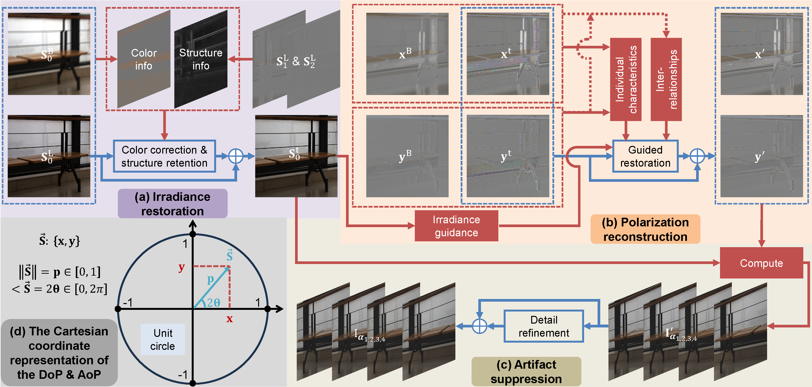

# Towards a Unified Complementary Fusion Framework for Robust Polarimetric Imaging

By [Chu Zhou](https://fourson.github.io/), Yixing Liu, Minggui Teng, Chao Xu, [Boxin Shi](http://ci.idm.pku.edu.cn/), [Imari Sato](https://research.nii.ac.jp/pbv/)


[PDF](https://ieeexplore.ieee.org/stamp/stamp.jsp?tp=&arnumber=11397831) | [SUPP](https://ieeexplore.ieee.org/ielx8/34/11552636/11397831/supp1-3665927.pdf?arnumber=11397831)

This is the extended journal version of our NeurIPS 2024 paper: [Quality-Improved and Property-Preserved Polarimetric Imaging via Complementarily Fusing](https://github.com/fourson/Quality-Improved-and-Property-Preserved-Polarimetric-Imaging-via-Complementarily-Fusing)

## Abstract
Polarization, as an intrinsic property of light alongside amplitude and phase, has demonstrated great potential in a variety of downstream applications by providing valuable physical cues encoded in the degree of polarization (DoP) and the angle of polarization (AoP). Polarimetric imaging aims to acquire these polarimetric parameters by capturing polarized snapshots. However, compared to conventional imaging, it faces greater difficulties due to the presence of polarizers, which attenuate light intensity in a spatially variant manner. Such attenuation complicates exposure control: a short exposure leads to low signal-to-noise ratio and color distortion, whereas a relatively long exposure increases the risk of motion blur and saturation. To address these challenges, this work proposes PolFusion+, a unified framework that robustly produces clean and sharp polarized snapshots by complementarily fusing a degraded pair of short-exposed noisy and long-exposed blurry inputs. Building upon a polarization-aware three-phase fusion scheme, PolFusion+ introduces two key advancements. First, to handle saturation in the blurry snapshot, the irradiance restoration phase extracts and rectifies color information from both inputs, effectively mitigating saturation-induced degradation. Second, to ensure physically faithful polarization reconstruction, the framework explicitly models the individual characteristics and interdependencies of the DoP and AoP, enabling their joint restoration. These improvements are supported by a degradation-oriented neural network tailored to the fusion scheme. Experimental results demonstrate that PolFusion+ achieves state-of-the-art performance, effectively benefiting downstream applications.
## Prerequisites
* Linux Distributions (tested on Ubuntu 22.04).
* NVIDIA GPU and CUDA cuDNN
* Python >= 3.8
* Pytorch >= 2.2.0
* cv2
* numpy
* tqdm
* tensorboardX (for training visualization)

## Pre-trained models
* We provide the [pre-trained models](https://1drv.ms/u/c/a7790f0fe4911ab5/IQDjBlY2iJIWR7h87HxRCXx_AVOXqIfdIG3DFXjc1VjjCy0) for inference
* Please put the downloaded files (`full.pth`) into the `checkpoint` folder

## Inference
```
python execute/infer_full.py -r checkpoint/full.pth --data_dir <path_to_input_data> --result_dir <path_to_result_data> --data_loader_type WithoutGroundTruthDataLoader default
```

## Visualization
Since the file format we use is `.npy`, we provide scrips for visualization:
* use `notebooks/visualize_aop.py` to visualize the AoP
* use `notebooks/visualize_dop.py` to visualize the DoP
* use `notebooks/visualize_S0.py` to visualize S0

## How to make the dataset
* First, please follow the guidance of the [PLIE dataset](https://github.com/fourson/Polarization-Aware-Low-Light-Image-Enhancement/tree/master) to preprocess the raw images
  * Until you obtain two folders named as `raw_images/data_train_temp` and `raw_images/data_test_temp` respectively
* Then, run `python scripts/make_dataset_for_train.py` and `python scripts/make_dataset_for_test.py` respectively
  * This will generate two folders named as `data_NeurIPS24/train` and `data_NeurIPS24/test` respectively
* Furthermore, run `python scripts/make_dataset_for_extension.py`
  * After that, run `python scripts/compute_DoP_AoP_S0_for_test.py`
* Finally, you should obtain all the data for training and testing
  
## Training your own model
* First, train Phase1 (Irradiance restoration) and Phase2 (Polarization reconstruction) independently:
  * run `python execute/train.py -c config/phase1.json` and `python execute/train.py -c config/phase2.json`
* Then, train the entire network in an end-to-end manner:
  * run `python execute/train.py -c config/full.json --phase1_checkpoint_path <path_to_phase1_checkpoint> --phase2_checkpoint_path <path_to_phase2_checkpoint>`

Note that all config files (`config/*.json`) and the learning rate schedule function (MultiplicativeLR) at `get_lr_lambda` in `utils/util.py` could be edited

## About the metrics
* To align with previous works, we compute PSNR/SSIM following these steps:
  * For S0 (in the range of [0, 2])
    * Divide it by 2 to normalize its values to [0, 1]
    * Compute PSNR/SSIM
  * For DoP (in the range of [0, 1])
    * Average three color channels into a single average channel
    * Copy the average channel back to three channel
    * Compute PSNR/SSIM
  * For AoP (in the range of [0, pi])
    * Divide it by pi to normalize its values to [0, 1]
    * Average three color channels into a single average channel
    * Copy the average channel back to three channel
    * Compute PSNR/SSIM

## Citation
If you find this work helpful to your research, please cite:
```
@article{zhou2026towards,
  title={Towards a unified complementary fusion framework for robust polarimetric imaging},
  author={Zhou, Chu and Liu, Yixing and Teng, Minggui and Xu, Chao and Shi, Boxin and Sato, Imari},
  journal=TPAMI,
  volume={48},
  number={7},
  pages={7720--7734},
  year={2026}
}
```
and also our NeurIPS conference version:
```
@inproceedings{NEURIPS2024_f543648b,
 author = {Zhou, Chu and Liu, Yixing and Xu, Chao and Shi, Boxin},
 booktitle = {Advances in Neural Information Processing Systems},
 editor = {A. Globerson and L. Mackey and D. Belgrave and A. Fan and U. Paquet and J. Tomczak and C. Zhang},
 pages = {136018--136036},
 publisher = {Curran Associates, Inc.},
 title = {Quality-Improved and Property-Preserved Polarimetric Imaging via Complementarily Fusing},
 url = {https://proceedings.neurips.cc/paper_files/paper/2024/file/f543648b4332a4d8b9e1b72c6b4e2e26-Paper-Conference.pdf},
 volume = {37},
 year = {2024}
}
```
